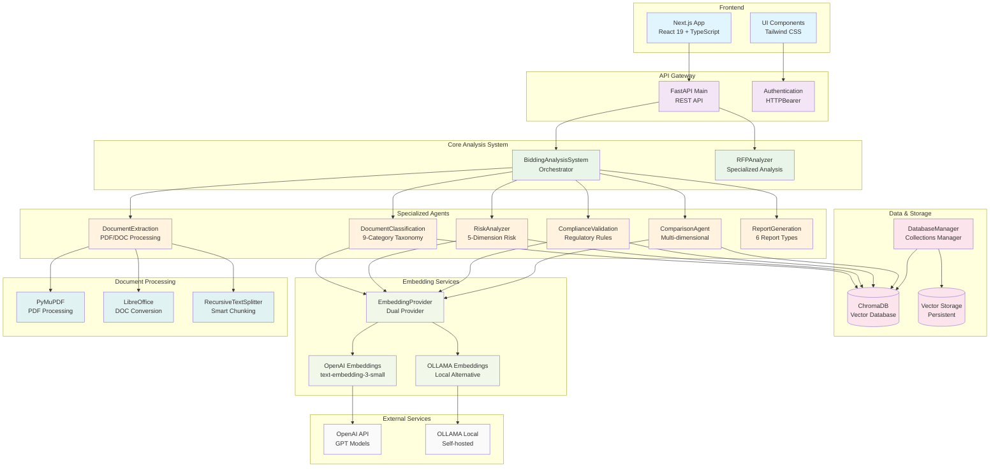

# Hackiathon 2025 - Team draAIgon
## Reto 1 - Optimización Inteligente de Procesos de Licitación en Construcción

## Stack Tecnológico

### Backend
- **Python 3.10+** - Lenguaje principal
- **FastAPI** - Framework web para APIs REST
- **LangChain** - Framework para aplicaciones con LLM
- **ChromaDB** - Base de datos vectorial
- **PyMuPDF** - Procesamiento de documentos PDF
- **OpenAI GPT-4** - Modelos de lenguaje
- **OLLAMA** - Modelos locales alternativos
- **Pydantic** - Validación de datos
- **LibreOffice** - Conversión de documentos

### Frontend
- **Next.js 15** - Framework React de producción
- **React 19** - Biblioteca de interfaces de usuario
- **TypeScript** - Tipado estático para JavaScript
- **Tailwind CSS 4** - Framework de estilos utility-first
- **Node.js** - Runtime de JavaScript

### AI/ML Stack
- **OpenAI Embeddings** (text-embedding-3-small)
- **RecursiveCharacterTextSplitter** - Chunking de documentos
- **Vector Similarity Search** - Búsqueda semántica
- **Multi-Agent Architecture** - Sistema distribuido de agentes especializados

### Herramientas de Desarrollo
- **ESLint** - Linter para JavaScript/TypeScript
- **Pytest** - Framework de testing para Python
- **Git** - Control de versiones
- **Docker** - Contenedorización (opcional)

## Arquitectura



### Componentes de la Arquitectura

#### Frontend Layer
- **Next.js App**: Aplicación web moderna con React 19 y Tailwind CSS
- **UI Components**: Componentes reutilizables para análisis y visualización

#### API Gateway
- **FastAPI Main**: API REST principal con documentación automática (/docs)
- **Authentication**: Sistema de seguridad con HTTPBearer tokens

#### Core Analysis System  
- **BiddingAnalysisSystem**: Orquestador central que coordina todos los agentes
- **RFPAnalyzer**: Analizador especializado para Request for Proposals

#### Specialized Agents
- **DocumentExtraction**: Procesamiento de PDF/DOC con OCR
- **DocumentClassification**: Clasificación semántica en 9 categorías
- **RiskAnalyzer**: Análisis de riesgos en 5 dimensiones (técnico, económico, legal, operacional, proveedor)
- **ComplianceValidation**: Validación de cumplimiento normativo
- **ComparisonAgent**: Comparación multi-dimensional de propuestas
- **ReportGeneration**: Generación de 6 tipos de reportes (HTML/JSON/PDF)

#### Data & Storage Layer
- **ChromaDB**: Base de datos vectorial para embeddings
- **DatabaseManager**: Gestor centralizado de colecciones vectoriales
- **Vector Storage**: Almacenamiento persistente de embeddings

#### Embedding Layer
- **EmbeddingProvider**: Proveedor dual con fallback automático
- **OpenAI Embeddings**: text-embedding-3-small para análisis semántico
- **OLLAMA Embeddings**: Alternativa local/gratuita

#### Document Processing
- **PyMuPDF**: Procesamiento avanzado de archivos PDF
- **LibreOffice**: Conversión de documentos DOC/DOCX
- **RecursiveTextSplitter**: Chunking inteligente (1000 chars, 200 overlap)

#### External Services
- **OpenAI API**: Servicios de embeddings y procesamiento de lenguaje
- **OLLAMA Local**: Modelos de embeddings ejecutados localmente

## Guía de Ejecución

### Configuración del Entorno

1. **Configurar variables de entorno**:
```bash
cp .env.example .env
# Editar .env con tu OPENAI_API_KEY
```

2. **Instalar dependencias del backend**:
```bash
cd backend
pip install -r requirements_pdf.txt
```

3. **Instalar dependencias del frontend**:
```bash
cd frontend
npm install
```

### Ejecución de Servicios

#### Iniciar el Backend API
```bash
# Opción 1: Desarrollo con auto-reload
fastapi dev backend/api/main.py --host 0.0.0.0

# Opción 2: Puerto específico
fastapi dev backend/api/main.py --host 0.0.0.0 --port 8001
```

#### Iniciar el Frontend
```bash
# Desarrollo con Next.js
cd frontend
npm run dev
```

### Acceso a los Servicios

- **API Backend**: http://localhost:8000
- **Documentación API**: http://localhost:8000/docs (Swagger UI)
- **Frontend**: http://localhost:3000
- **API Alternative**: http://localhost:8001 (si se usa puerto alternativo)

### Endpoints Principales

- `POST /api/v1/analysis/upload` - Análisis completo de documentos
- `POST /api/v1/comparison/upload-multiple` - Comparación de propuestas
- `GET /api/v1/reports/generate/{document_id}` - Generación de reportes
- `POST /api/v1/rfp/analyze` - Análisis especializado de RFP
- `GET /api/v1/utils/system-status` - Estado del sistema

### Configuración Opcional

#### Para usar OLLAMA (alternativa gratuita):
```bash
# Instalar OLLAMA
curl -fsSL https://ollama.ai/install.sh | sh

# Descargar modelo de embeddings
ollama pull nomic-embed-text
```

#### Para instalar LibreOffice (conversión de documentos):
```bash
# Ubuntu/Debian
sudo apt-get install libreoffice

# macOS
brew install --cask libreoffice

# Windows
# Descargar desde https://www.libreoffice.org/
```
