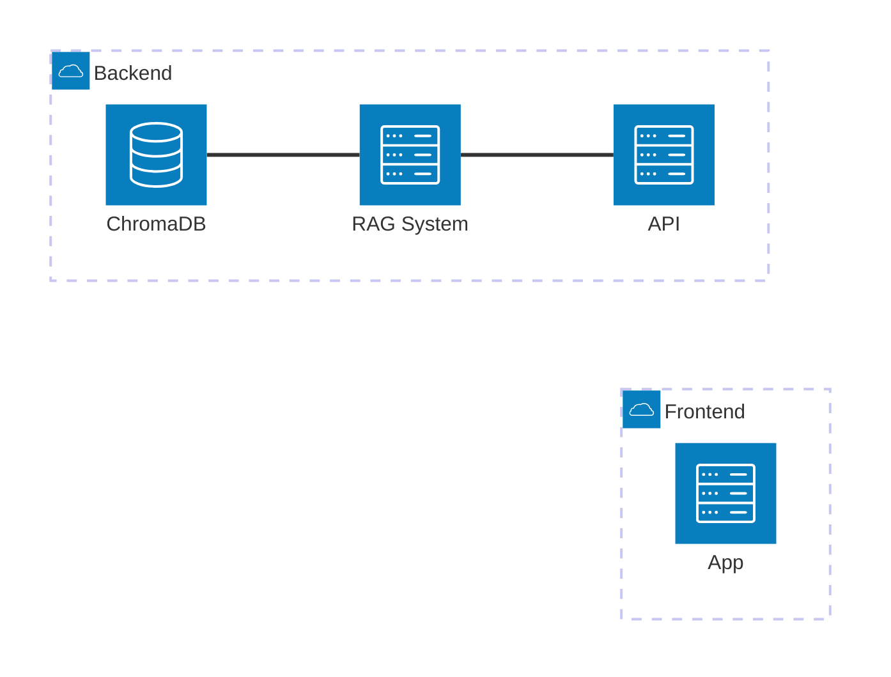

# Hackiathon 2025 - Team draAIgon
## Reto 1 - Optimización Inteligente de Procesos de Licitación en Construcción

## Stack Tecnológico
* Python 3.10+
* FastAPI
* LangChain
* OpenAI GPT-4.1
* PyMuPDF
* DSPy

## Arquitectura



## Guia de ejecución

* Iniciar el API Gateway

```
fastapi dev backend/api.py --host 0.0.0.0
```

* Iniciar el frontend

```
python3 -m http.server 8888 --directory frontend
```
